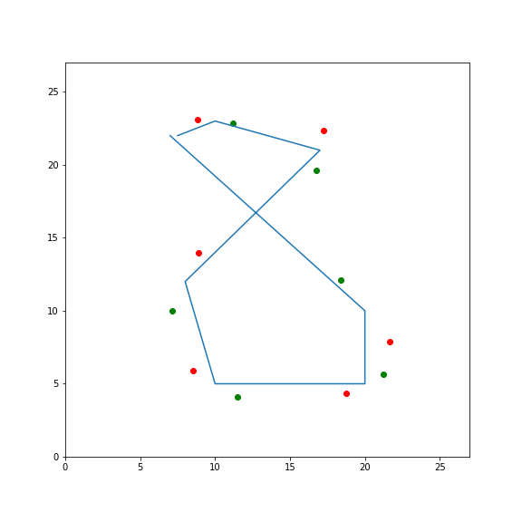
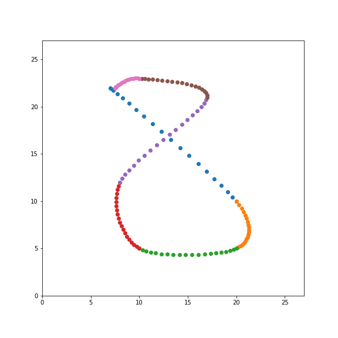
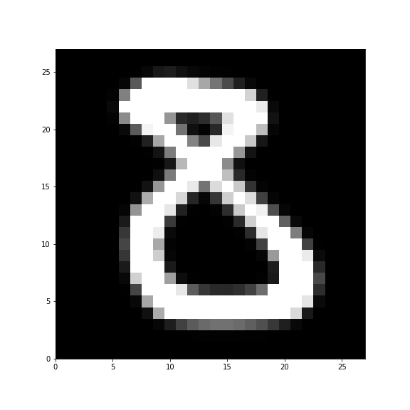

# mnist-sbi

Simulation Based Inference for the important problem of drawing digits.

## Status: Work In Progress

Currently writing the simulator. No machine learning and no inference yet.

## Objective

This is a learning experiment to teach my-self Simulation Based Inference on a
high-dimensional problem that is simple enough to be used as an education
resource, but high dimensional enough to highlight challenges of SBI
applications to scientific domains.

The goal is to infer an estimate of the posterior distribution of the
parameters of a mechanistic model that draws MNIST-style digits using modern
Neural Network based inference scheme.

Some references on SBI:

- The frontier of simulation-based inference, Cranmer et al., PNAS 2020
  ([paper](https://www.pnas.org/content/117/48/30055))

- Benchmarking Simulation-Based Inference, Lueckmann et al., ICML 2021
  ([paper](http://proceedings.mlr.press/v130/lueckmann21a.html), [code](
  https://github.com/sbi-benchmark/sbibm))

## The MNIST simulator

The first step is to build a forward, mechanistic model of the data generating
process. We decide to approximate the prodcess of a human drawing the curve of
a digit on a piece of paper using a smooth [cubic Bézier
curve](https://en.wikipedia.org/wiki/B%C3%A9zier_curve#Cubic_B%C3%A9zier_curves)
with a few segments.

The control points of consecutive cubic segments are symmetrised to impose smoothness:

Each segment is rendered by a few tens of intermediary points on the path:

The result is then rasterized on a 28 x 28 pixel grid by using a saturated
Gaussian blur applied to approximately even spaced points of the Bezier path.

The rasterization process it-self has unkown parameters: the density of dots
per segments, the thickness and the saturation parameters for instance.
